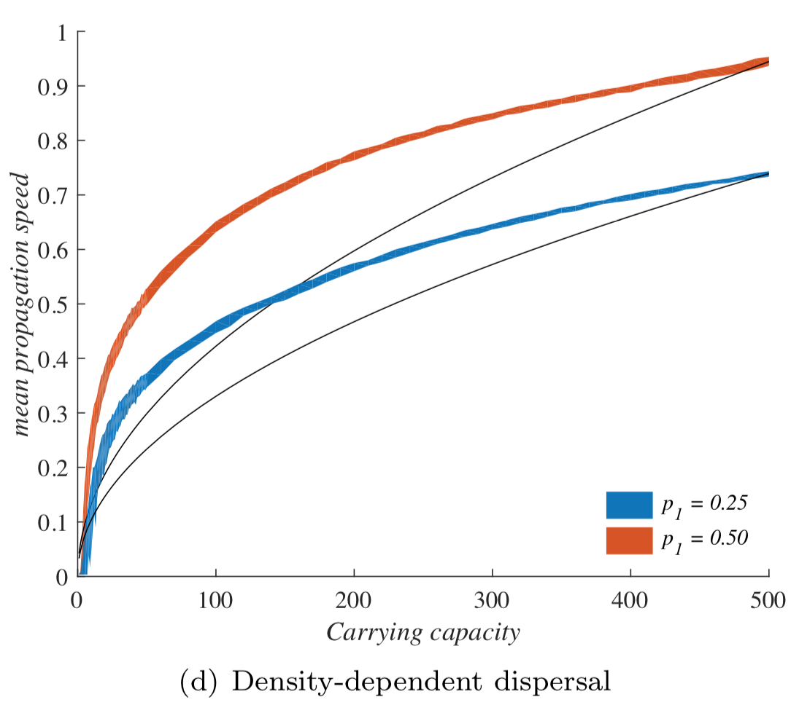

# Introduction {-}

This is an example of text. This realization is especially important because it can flip around our expectations about which species expand fast, and how to manage them. We tend to think of initial colonization and long-term abundance as two independent axes of variation among species or indeed as two ends of a spectrum, in the classic competition-colonization tradeoff [@levins1971regional]. When both play into invasion speed, good dispersers might not outrun good competitors. This is useful knowledge, whether we want to contain an invasion or secure a reintroduction.

In their study "When higher carrying capacities lead to faster propagation", @preprint combine mathematical analysis, Individual-Based simulations and experiments to show that various mechanisms can cause pushed fronts, whose speed increases with the carrying capacity K of the species. Rather than focus on one particular angle, the authors endeavor to demonstrate that this qualitative effect appears again and again in a variety of settings.

It is perhaps surprising that this notable and general connection between K and invasion speed has managed to garner so little fame in ecology. A large fraction of the literature employs the venerable Fisher-KPP reaction-diffusion model, which combines local logistic growth with linear diffusion in space. This model has prompted both considerable mathematical developments [@crooks2004spatial] and many applications to modelling real invasions [@shigesada1997biological]. But it only allows pulled fronts, driven by the small populations at the edge of a species range, with a speed that depends only on their initial growth rate r.

# Methods {-}

more text 

## Statistical analyses {-}

more text

# Results {-}

text

```{r fig1, echo=FALSE, fig.cap="Caption", out.width="10cm"}
x <- 1:10
y <- 11:20
plot(x, y)
```

$y_{i} = x$

<!--insert figure this way, other ways are untested for this template-->

```{r, echo=FALSE, out.width="10cm", fig.cap="caaaaaaaaption"}

```

<!--do a test with a table-->

some text

```{r, echo=FALSE, out.width="10cm", fig.cap="more"}

```

# Discussion {-}

text

# Data accessibility {-}

Data are available online: link or DOI of the webpage hosting the data

# Supplementary material {-}

Script and codes are available online: link or DOI of the webpage hosting the script and codes

# Acknowledgements {-}

This is your Acknowledgements

# Conflicts of interest disclosure {-}

The authors of this preprint declare that they have no financial conflict of interest with the content of this article. XXX and XXX are recommenders for PCI XXX


<!--a little bit of LaTeX verbatim to place the references here, before the (potential) appendices:-->
\printbibliography[notcategory=ignore]

<!--delete or comment out everything after this if you do not use appendices-->
# Appendix {-}

This is your appendix 1 or the link to appendix 1  
This is your appendix 2 or the link to appendix 2
