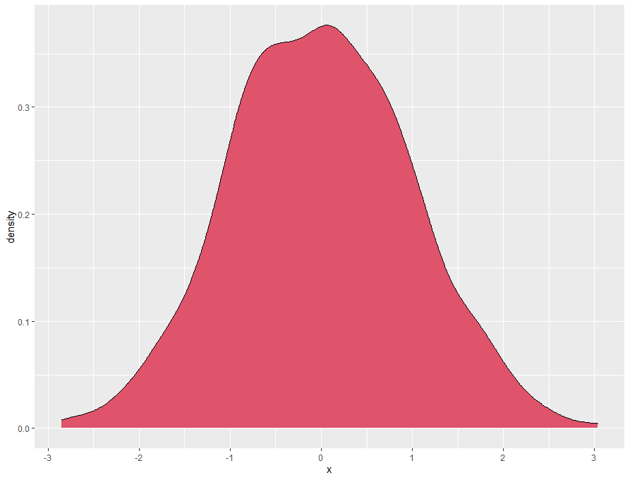

```{r setup, include=FALSE}
library(knitr)
knitr::opts_chunk$set(echo = FALSE, eval = TRUE)
options(knitr.table.format = "latex")
#document-wide settings: 
# load required packages
# unless explicitly indicated, do not print code alongside with code chunks in document
#### end of "DO NOT CHANGE" block
################################
```

# Introduction {-}

 Note the use of {-} in headers in the code to suppress automatic header numbering. Do not forget it when you add your own custom headers and subheaders!
 
This is an example of text. This is an example of citation [@levins1971regional]. If you want to format your citations with authors outside parentheses, you can too: "@levins1971regional once wrote something important".


And now, some filler text. Lorem ipsum dolor sit amet, consectetur adipiscing elit, sed do eiusmod tempor incididunt ut labore et dolore magna aliqua. Ut enim ad minim veniam, quis nostrud exercitation ullamco laboris nisi ut aliquip ex ea commodo consequat. Duis aute irure dolor in reprehenderit in voluptate velit esse cillum dolore eu fugiat nulla pariatur. Excepteur sint occaecat cupidatat non proident, sunt in culpa qui officia deserunt mollit anim id est laborum.Lorem ipsum dolor sit amet, consectetur adipiscing elit, sed do eiusmod tempor incididunt ut labore et dolore magna aliqua. Ut enim ad minim veniam, quis nostrud exercitation ullamco laboris nisi ut aliquip ex ea commodo consequat. Duis aute irure dolor in reprehenderit in voluptate velit esse cillum dolore eu fugiat nulla pariatur. Excepteur sint occaecat cupidatat non proident, sunt in culpa qui officia deserunt mollit anim id est laborum.

In their study, @preprint combine mathematical analysis, Individual-Based simulations and experiments to study expansions. At vero eos et accusamus et iusto odio dignissimos ducimus qui blanditiis praesentium voluptatum deleniti atque corrupti quos dolores et quas molestias excepturi sint occaecati cupiditate non provident, similique sunt in culpa qui officia deserunt mollitia animi, id est laborum et dolorum fuga. Et harum quidem rerum facilis est et expedita distinctio. Nam libero tempore, cum soluta nobis est eligendi optio cumque nihil impedit quo minus id quod maxime placeat facere possimus, omnis voluptas assumenda est, omnis dolor repellendus. Temporibus autem quibusdam et aut officiis debitis aut rerum necessitatibus saepe eveniet ut et voluptates repudiandae sint et molestiae non recusandae. Itaque earum rerum hic tenetur a sapiente delectus, ut aut reiciendis voluptatibus maiores alias consequatur aut perferendis doloribus asperiores repellat

Lists can be included following standard Markdown syntax:

- this is a thing

- this is another thing

- one last thing

List elements don't need to be separated by empty lines:

- a thing
- another thing

Lists can be numbered:

1. a thing

2. a second thing


# Methods {-}

This is filler text. At vero eos et accusamus et iusto odio dignissimos ducimus qui blanditiis praesentium voluptatum deleniti atque corrupti quos dolores et quas molestias excepturi sint occaecati cupiditate non provident, similique sunt in culpa qui officia deserunt mollitia animi, id est laborum et dolorum fuga. Et harum quidem rerum facilis est et expedita distinctio. Nam libero tempore, cum soluta nobis est eligendi optio cumque nihil impedit quo minus id quod maxime placeat facere possimus, omnis voluptas assumenda est, omnis dolor repellendus. Temporibus autem quibusdam et aut officiis debitis aut rerum necessitatibus saepe eveniet ut et voluptates repudiandae sint et molestiae non recusandae. Itaque earum rerum hic tenetur a sapiente delectus, ut aut reiciendis voluptatibus maiores alias consequatur aut perferendis doloribus asperiores repellat. [@shigesada1997biological].

## Statistical analyses {-}

See how to create headers and various levels of subheaders with `#`.

Markdown documents can use LaTeX syntax to display equations, either inline: $y_{i} = x$, or as their own equation block:

$$y_{i} = x$$

# Results {-}

```{r fig1, fig.cap="A good figure, generated directly from code within the RMarkdown document", out.width="10cm"}
x <- 1:10
y <- 11:20
plot(x, y)
```

This is your Results part. Results are sometimes displayed in tables. Tables can be included in several ways. **The preferred method for this template** is through the use of the `kable` package and its extensions, like `kableExtra` for restyling. Other methods, like inputting a Markdown table directly in the text, have been known to lead to pagination bugs in some cases, that have not been ironed out yet.

```{r table-kable}
knitr::kable(head(mtcars[, 1:4]), caption= "This is a table", 
             booktabs = T)
#the format="latex" argument is REQUIRED for proper rendering in final pdf
# but it is set globally at the start of the document,
# so no need to give it in each table
```

Note in the code where the caption is, and that tables are automatically numbered in the order of their introduction (independently of the chunk label).

Tables and figures can be cross-referenced using the `\@ref(a:b)` syntax, where *a* is the object type ("tab" for tables, "fig" for figures, "eqn" for equations) and *b* the label of the corresponding chunk. For instance, see Table \@ref(tab:table-kable).

```{r table-kable2}
knitr::kable(head(mtcars[, 5:8]), caption= "This is also a table, but with vertical lines kept")
```

One can also easily add figures, either directly generated with code in-file (like Fig.\@ref(fig:fig1)), or imported (like Figs.\@ref(fig:fig2)-\@ref(fig:fig3)). There are several ways to import figures in RMarkdown; the preferred way in this template is to use `include_figures()` within a chunk. This makes in particular figure scaling much easier, and allows you to import pdf files as figures.

Figures will place themselves in order of their introduction in the code, but where there is room, so not necessarily where you placed them *relative to text*. Play with structure to obtain the effect you want.


```{r fig2, fig.cap="A great figure", out.width="5cm"}

```


```{r fig3, out.width="10cm", fig.cap="A figure, but imported for a pdf source. Advantages: never pixelated, even when zooming in; also, text is selectable"}
knitr::include_graphics("resources/Fig3.pdf")
```

If you want to display the actual code for a chunk (may be useful for some methods paper), you can:

```{r test, echo = TRUE, eval = FALSE}
a <- 2
```

(set the `echo` argument of the chunk to `TRUE` to override the default and make the code visible, set the `eval` argument to `FALSE` if this is code you want to show, not run. See general Rmarkdown help pages for more on chunk arguments)

# Discussion {-}

Some filler text again. At vero eos et accusamus et iusto odio dignissimos ducimus qui blanditiis praesentium voluptatum deleniti atque corrupti quos dolores et quas molestias excepturi sint occaecati cupiditate non provident, similique sunt in culpa qui officia deserunt mollitia animi, id est laborum et dolorum fuga. Et harum quidem rerum facilis est et expedita distinctio. Nam libero tempore, cum soluta nobis est eligendi optio cumque nihil impedit quo minus id quod maxime placeat facere possimus, omnis voluptas assumenda est, omnis dolor repellendus. Temporibus autem quibusdam et aut officiis debitis aut rerum necessitatibus saepe eveniet ut et voluptates repudiandae sint et molestiae non recusandae. Itaque earum rerum hic tenetur a sapiente delectus, ut aut reiciendis voluptatibus maiores alias consequatur aut perferendis doloribus asperiores repellat. [@crooks2004spatial] 

Sed ut perspiciatis unde omnis iste natus error sit voluptatem accusantium doloremque laudantium, totam rem aperiam, eaque ipsa quae ab illo inventore veritatis et quasi architecto beatae vitae dicta sunt explicabo. Nemo enim ipsam voluptatem quia voluptas sit aspernatur aut odit aut fugit, sed quia consequuntur magni dolores eos qui ratione voluptatem sequi nesciunt. Neque porro quisquam est, qui dolorem ipsum quia dolor sit amet, consectetur, adipisci velit, sed quia non numquam eius modi tempora incidunt ut labore et dolore magnam aliquam quaerat voluptatem. Ut enim ad minima veniam, quis nostrum exercitationem ullam corporis suscipit laboriosam, nisi ut aliquid ex ea commodi consequatur? Quis autem vel eum iure reprehenderit qui in ea voluptate velit esse quam nihil molestiae consequatur, vel illum qui dolorem eum fugiat quo voluptas nulla pariatur?[@shigesada1997biological]. 

# Data accessibility {-}

Data are available online: link and/or DOI of the webpage hosting the data

# Supplementary material {-}

Script and codes are available online: link and/or DOI of the webpage hosting the script and codes

# Acknowledgements {-}

This is where you place your Acknowledgements (may include funding sources; or that can be in its separate section).

# Conflicts of interest disclosure {-}

The authors of this preprint declare that they have no financial conflict of interest with the content of this article. XXX and XXX are recommenders for PCI XXX


<!--a little bit of LaTeX verbatim to place the references here, before the (potential) appendices:-->
\printbibliography[notcategory=ignore]

<!--delete or comment out everything after this if you do not use appendices-->
# Appendix {-}

This is your appendix 1 or the link to appendix 1  
This is your appendix 2 or the link to appendix 2
